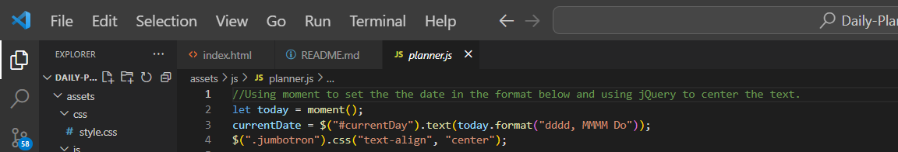
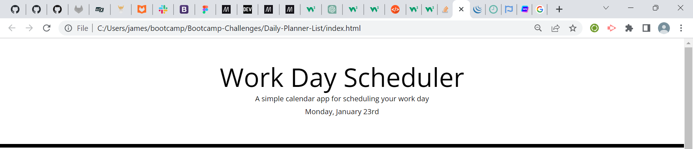
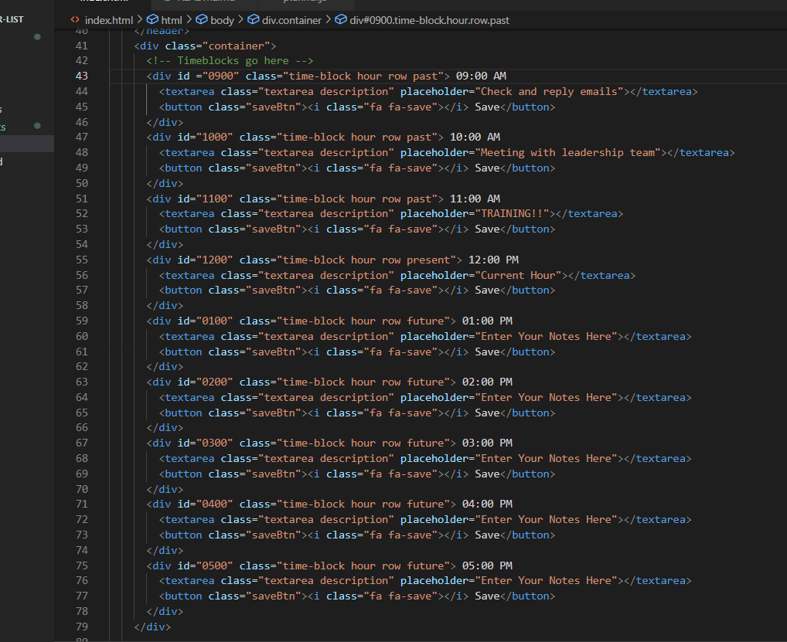
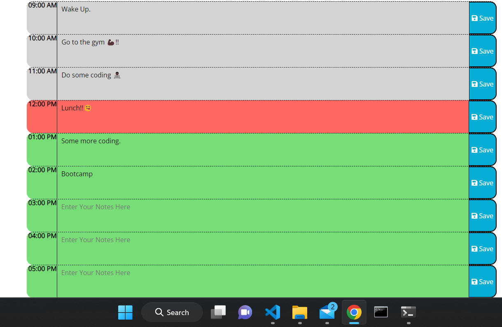
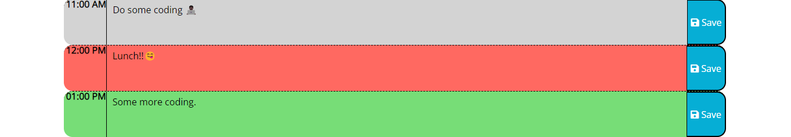
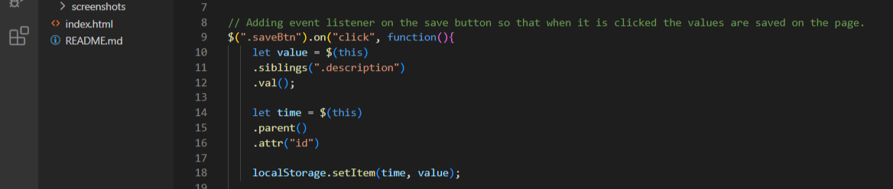
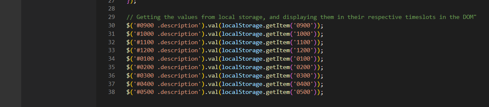
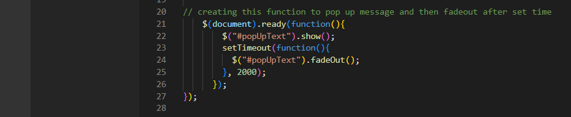
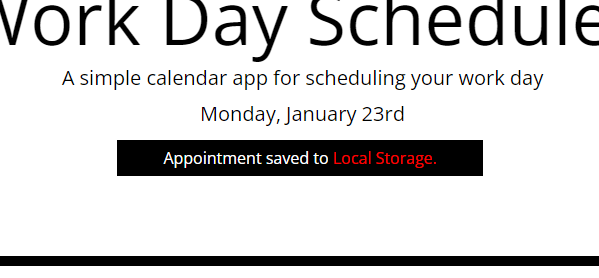

# Daily-Planner-List

## Project
This project was about creating a simple calendar application that allows a user to save events for each hour of the day by modifying starter code.

## User Story
AS AN employee with a busy schedule.
I WANT to add important events to a daily planner.
SO THAT I can manage my time effectively.

## Acceptance Criteria
In order for the 'Acceptance Criteria' to be met, the web application should be able to:

1. Display the current day at the top of the calendar when a user opens the planner.
2. Present timeblocks for standard business hours when the user scrolls down.
3. Colour-code each timeblock based on past, present, and future when the timeblock is viewed.
4. Allow a user to enter an event when they click a timeblock.
5. Save the event in local storage when the save button is clicked in that timeblock
6. Persist events between refreshes of a page

## Outcome
I successfully achieved the acceptance criteria, and with my code the web application is now able to:

1. Display the current day at the top of the calendar when the user opens the planner.
2. Present timeblocks for standard business hours from 9AM - 5PM when the user scrolls down.
3. Colour-code each timeblock based on past, future and present.
4. Allow user to enter an event when they click a timeblock.
5. Allow the user to save an event when the save button is clicked in that timeblock.
6. Events saved on the planner still appear when the browser is refreshed.

## Screenshots
1. The code for displaying the current day at the top of the calendar.
 

2. The browser version of the current day at the top of the calendar being displayed.
 

3. The HTML timeblocks code.
 

4. The timeblocks being displayed on the browser.
 

5. The timeblocks colour-coded. Grey = Past, Red = Present and Green = Future.
 

6. The code for the save button function.
 

7. The code for retrieving value from local storage thus allowing event to be saved in planner.
 

8. Code for pop-up message when save button is clicked.
 

9. Pop-up message when save button is clicked.
 

## License
MIT License

Copyright (c) 2022 JayClay922

Permission is hereby granted, free of charge, to any person obtaining a copy of this software and associated documentation files (the "Software"), to deal in the Software without restriction, including without limitation the rights to use, copy, modify, merge, publish, distribute, sublicense, and/or sell copies of the Software, and to permit persons to whom the Software is furnished to do so, subject to the following conditions:

The above copyright notice and this permission notice shall be included in all copies or substantial portions of the Software.

THE SOFTWARE IS PROVIDED "AS IS", WITHOUT WARRANTY OF ANY KIND, EXPRESS OR IMPLIED, INCLUDING BUT NOT LIMITED TO THE WARRANTIES OF MERCHANTABILITY, FITNESS FOR A PARTICULAR PURPOSE AND NONINFRINGEMENT. IN NO EVENT SHALL THE AUTHORS OR COPYRIGHT HOLDERS BE LIABLE FOR ANY CLAIM, DAMAGES OR OTHER LIABILITY, WHETHER IN AN ACTION OF CONTRACT, TORT OR OTHERWISE, ARISING FROM, OUT OF OR IN CONNECTION WITH THE SOFTWARE OR THE USE OR OTHER DEALINGS IN THE SOFTWARE.

## Deployed Web Application
The URL of the deployed web application is:
